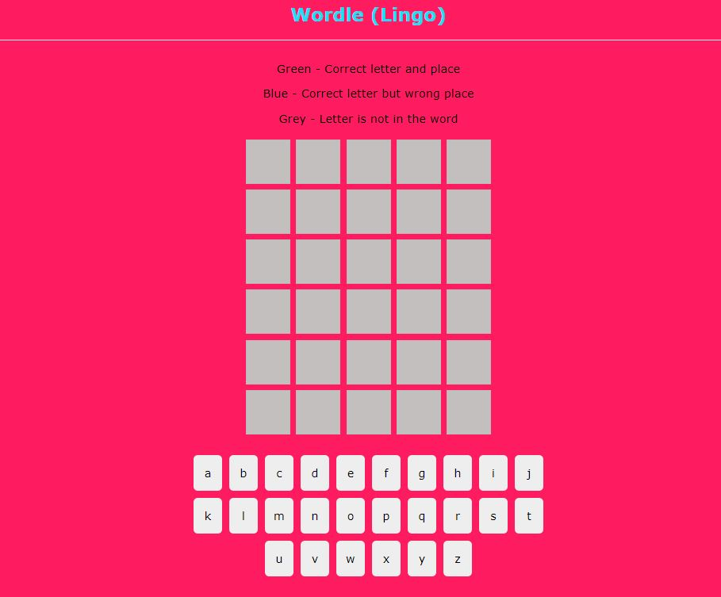

# Wordle Game
A fun game where the user can try 6 times to guess a word. I used the Net Ninja you tube videos to complete this (https://www.youtube.com/watch?v=ZSWl5UwhHcs)

## Table of contents

- [Overview](#overview)
  - [The challenge](#the-challenge)
  - [Screenshot](#screenshot)
  - [Links](#links)
- [My process](#my-process)
  - [Built with](#built-with)
- [Author](#author)

## Overview

### The challenge

Users should be able to:

- Enter in a max of 5 letters to guess a word
- A word can not be repeated
- Only 6 chances allowed to guess the word, once all used a modal ops up to say all chances done as well as the solution
- Background color of letter changes to show if letter is in word as well as if in the correct place or not
- If correct word is typed in the game should end and user should see amount of tries taken as well as solution

### Screenshot

### Links

- Github Solution: [https://github.com/BiancaNiemann/React-Wordle](https://github.com/BiancaNiemann/React-Wordle).
- Live Site [https://react-wordle-gamma.vercel.app/](https://react-wordle-gamma.vercel.app/)

## My process

### Built with

- HTML5 
- CSS
- React

## Author

- Website - [Bianca Niemann](https://portfolio-seven-sepia-13.vercel.app/)
- LinkedIn - [@BiancaNiemann](https://www.linkedin.com/in/bianca-niemann-8671b1246/)